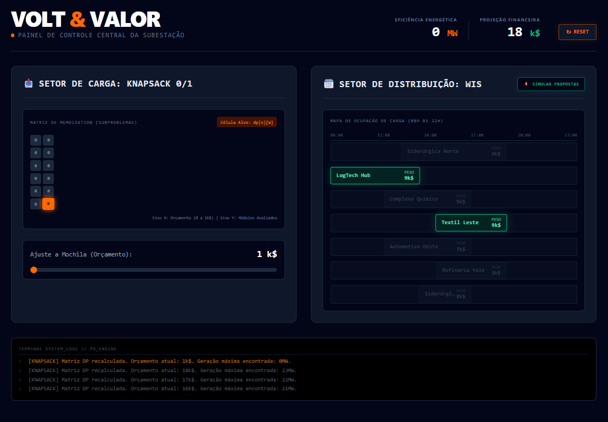

# Volt & Valor

**Número do trabalho:**: 4<br>
**Conteúdo da Disciplina**: Programação Dinâmica<br>

## Alunos
|Matrícula | Aluno |
| -- | -- |
| 190093625  |  Milena Beatriz Aires de Santana Dias |


## Sobre 
O **Volt & Valor** é um dashboard de simulação e otimização para subestações de energia elétrica. O objetivo do sistema é auxiliar engenheiros e gestores a tomarem decisões maximizadas sobre alocação de recursos e gerenciamento de tempo utilizando o paradigma de **Programação Dinâmica**.

O projeto resolve dois problemas críticos de infraestrutura de forma altamente eficiente ($\mathcal{O}(N \times W)$ e $\mathcal{O}(N \log N)$):
1. **Setor de Carga (Knapsack 0/1):** Otimiza a compra de módulos de bateria do mercado. Cada módulo possui um custo financeiro (peso) e um retorno em Megawatts (valor). O algoritmo preenche uma matriz de *Memoization* para garantir a maior entrega de energia possível sem estourar o orçamento limite da subestação.
2. **Setor de Distribuição (Weighted Interval Scheduling):** Organiza a escala de transmissão prioritária para grandes indústrias. Cada contrato possui um horário rígido de início, fim e um valor de patrocínio. O algoritmo ordena os intervalos, calcula o vetor de compatibilidade $p(j)$ e monta a grade ideal de contratos sem colisões de horário, maximizando o faturamento.

## Screenshots


<br>

## Apresentação 

_Clique na imagem para abrir o [vídeo](https://youtu.be/xUFXEZT4ufo)_


[](https://youtu.be/xUFXEZT4ufo)

## Instalação 
**Linguagem**: TypeScript, HTML, CSS<br>
**Framework**: React (Vite) com Tailwind CSS v4<br>

**Pré-requisitos:**
* Node.js (versão 18 ou superior)
* NPM ou outro gerenciador de pacotes

**Passo a passo para execução:**
1. Clone o repositório:
```bash
   git clone [https://github.com/projeto-de-algoritmos-2026/NOME_DO_SEU_REPOSITORIO.git](https://github.com/projeto-de-algoritmos-2026/NOME_DO_SEU_REPOSITORIO.git)
```

2. Acesse o diretório:

```bash
cd NOME_DO_SEU_REPOSITORIO

```


3. Instale as dependências:
```bash
npm install

```


4. Inicie o servidor local:
```bash
npm run dev

```

## Uso

Abra o endereço `http://localhost:5173` no seu navegador para interagir com o sistema:

1. **Otimização do Banco de Baterias:** Arraste o slider de "Orçamento Disponível". Note como a tabela numérica de *Memoization* é atualizada em tempo real e a célula correspondente ao resultado ótimo acende em destaque laranja.
2. **Escala de Contratos (WIS):** Clique no botão "Coletar Novas Propostas". O sistema gerará novas demandas de mercado com horários e valores aleatórios, e o algoritmo WIS reordenará e selecionará instantaneamente os contratos mais vantajosos financeiramente, destacando-os em verde na linha do tempo.
3. Use o terminal de logs na parte inferior para acompanhar a justificativa matemática de cada ação.


### 🚀 Último Passo no Terminal

Com o README atualizado com o seu nome e os prints salvos na pasta, execute o commit de encerramento da entrega:

```bash
git add .
git commit -m "docs: finaliza documentacao do README para a entrega de programacao dinamica"
git push origin main